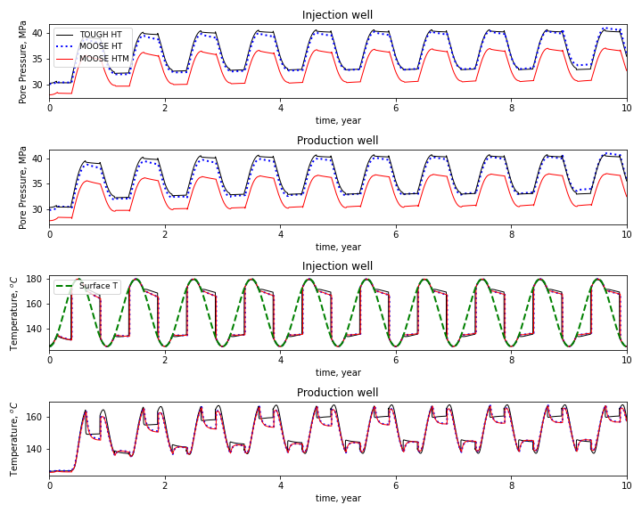

# Granular Flow Models
Granular flow constitutive model add-ons for ABAQUS  

<!--  -->

The software is a list of User MATerial subroutines (VUMAT) of Abaqus/Explicit for modeling granular flow physics.  It includes:
- density dependent Mohr-Coulomb model,
- density dependent Drager-Prager\Cap model,
- Gudehus-Bauer hypoplastic model, 
- critical state-based NorSand model. 

Each of the subroutines uses explicit/implicit integration algorithms to updates stress and state variables with a given increment of strain following the corresponding constitutive law.

### Configuration
The software is a user add-on code for Abaqus, it needs an Intel Fortran compiler to compile the code, and the version of the compiler needs to be compatible with the version of Abaqus. 

In Windows system, Abaqus requires Visual Studio with Fortran compiler. Combo example:
- Dassault Abaqus (2018)
- Microsoft Visual Studio 2017
- Intel Parallel Studio XE 2018

For Linux on HPC. Combo example:
- Dassault Abaqus (2018)
- Intel Fortran Compiler (ifort/2019.4.243-GCC-8.3.0-2.32)

### Input format
The input file for running granular flow simulation is a standard Abaqus inp file, except a few key words need to be added in the  following format:
* Material, name = (user define material name)
* Density (Initial density of the mateiral)
* Depvar (Number of the State variables)
* User Material, constants= (Number of the material parmeters followed by the value of material parameters)

### Running simulaiton
abaqus job=job-name input=inp-file-name user=subroutine-name double=both cpus=number-of-cores-for-parallel-simulation  int

### Author
Wencheng Jin, Idaho National Laboratory, wencheng.jin@inl.gov

### References
 - Jin, W., Stickel, J. J., Xia, Y., & Klinger, J. (2020). [A Review of Computational Models for the Flow of Milled Biomass Part II: Continuum-Mechanics Models](https://doi.org/10.1021/acssuschemeng.0c00412). ACS Sustainable Chemistry & Engineering, 8(16), 6157-6172.
 - Jin, W., Klinger, J., Westover, T., & Huang, H. (2020). [A density dependent Drucker-Prager/Cap model for ring shear simulation of ground loblolly pine](https://doi.org/10.1016/j.powtec.2020.04.038). Powder Technology, 368, 45-58.
 - Lu, Y., Jin, W., Klinger, J., Westover, T., & Dai, S. (2021). [Flow characterization of compressible biomass particles using multiscale experiments and a hypoplastic model](https://doi.org/10.1016/j.powtec.2021.01.027). Powder Technology.

### Other Software
Idaho National Laboratory is a cutting edge research facility which is a constantly producing high quality research and software. Feel free to take a look at our other software and scientific offerings at:

[Primary Technology Offerings Page](https://www.inl.gov/inl-initiatives/technology-deployment)

[Supported Open Source Software](https://github.com/idaholab)

[Raw Experiment Open Source Software](https://github.com/IdahoLabResearch)

[Unsupported Open Source Software](https://github.com/IdahoLabCuttingBoard)

### License

Copyright 2020 Battelle Energy Alliance, LLC

Licensed under the GPL 2.0 (the "License");
you may not use this file except in compliance with the License.
You may obtain a copy of the License at

  https://opensource.org/licenses/GPL-2.0

Unless required by applicable law or agreed to in writing, software
distributed under the License is distributed on an "AS IS" BASIS,
WITHOUT WARRANTIES OR CONDITIONS OF ANY KIND, either express or implied.
See the License for the specific language governing permissions and
limitations under the License.

Licensing
-----
This software is licensed under the terms you may find in the file named "LICENSE" in this directory.

Developers
-----
By contributing to this software project, you are agreeing to the following terms and conditions for your contributions:

You agree your contributions are submitted under the GPL 2.0 license. You represent you are authorized to make the contributions and grant the license. If your employer has rights to intellectual property that includes your contributions, you represent that you have received permission to make contributions and grant the required license on behalf of that employer.