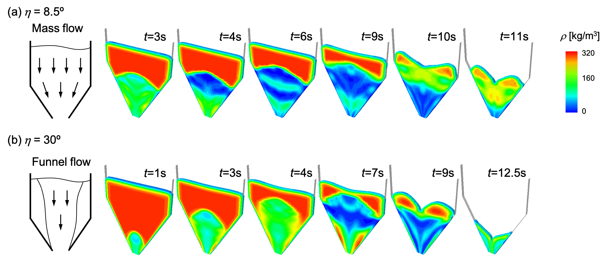
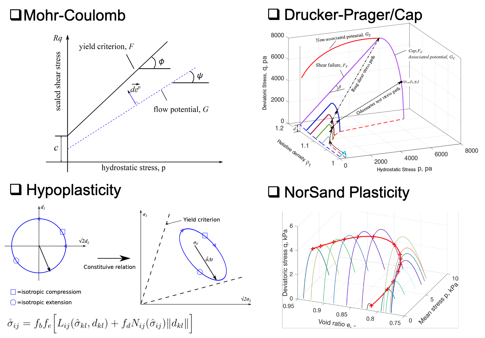

# Granular Flow Models
Granular flow constitutive model add-ons for ABAQUS

Citing Granular Flow Models
-----
If you are using Abaqus subroutines generated from this work, please cite the following articles:

 - Jin, W., Stickel, J. J., Xia, Y., & Klinger, J. (2020). [A Review of Computational Models for the Flow of Milled Biomass Part II: Continuum-Mechanics Models](https://doi.org/10.1021/acssuschemeng.0c00412). ACS Sustainable Chemistry & Engineering, 8(16), 6157-6172.
 - Jin, W., Klinger, J., Westover, T., & Huang, H. (2020). [A density dependent Drucker-Prager/Cap model for ring shear simulation of ground loblolly pine](https://doi.org/10.1016/j.powtec.2020.04.038). Powder Technology, 368, 45-58.
 - Lu, Y., Jin, W., Klinger, J., Westover, T., & Dai, S. (2021). [Flow characterization of compressible biomass particles using multiscale experiments and a hypoplastic model](https://doi.org/10.1016/j.powtec.2021.01.027). Powder Technology, 383, 396-409.

Documentation
-----
The software is a list of User MATerial subroutines (VUMAT) of Abaqus/Explicit for modeling granular flow physics.  It includes:
- Density dependent Mohr-Coulomb model (src/VUMAT_modified_Mohr_Coulomb.f),
- Density dependent Drager-Prager\Cap model (src/VUMAT_modified_Drager_Prager_cap.f),
- Gudehus-Bauer hypoplastic model (src/VUMAT_nonlocal_Hypoplasticity.f), 
- Critical state-based NorSand model (src/VUMAT_NorSand_version2015.f). 

Each of the subroutines uses explicit(sub-stepping)/implicit(return mapping) integration algorithms to updates stress and state variables (e.g., void ratio, density) with a given increment of strain following the corresponding constitutive law. The sketches of yield surfaces or the constitutive equation of each model are shown in the above figure. Please refer the references for detailed explaintion of the constitutive laws. For the hypoplasticity model, its integration-based nonlocal regularization is also implemented to alleviate the mesh dependence problem, and the thery is documented in [Wójcik and Tejchman, 2009](https://www.sciencedirect.com/science/article/abs/pii/S0032591009000588).

Instructions for Software 
-----

### Configuration
The software is a user add-on code for Abaqus, it needs an Intel Fortran compiler to compile the code, and the version of the compiler needs to be compatible with the version of Abaqus. 

For Windows on Desktop, Abaqus requires Visual Studio with Intel Fortran compiler. An example combo of the packages are:
- Dassault Abaqus (2018)
- Microsoft Visual Studio Community 2017
- Intel Parallel Studio XE 2018

For Linux on Desktop/HPC. An example combo of the packages are:
- Dassault Abaqus (2018)
- Intel Fortran Compiler (ifort/2019.4.243-GCC-8.3.0-2.32)

The software packages installation sequence and the linkage process among the packages in Windows OS is docmented [here](https://www.researchgate.net/publication/339133184_Linking_Abaqus_2020_Intel_Fortran_Compiler_160_Visual_Studio_2015_in_Windows_10_x64). The configuration in Linux system is to add the ifort path to the abaqus_v6.env file as: fortCmd = "/opt/intel/bin/ifort"

### Input format
The input file for running granular flow simulation is a standard Abaqus inp file using either Arbitrary Lagrangian-Eulerian (ALE) Method or Coupled Eulerian-Lagrangian (CEL) method, except a few key words need to be added in the  following format:
* Material, name = (user define material name)
* Density (Initial density of the mateiral)
* Depvar (Number of the State variables)
* User Material, constants= (Number of the material parmeters followed by the value of material parameters)

Taking the hopper flow simulation using hypoplasticity as an example, we define material parameters throught the following block:
>*Material, name=as_ground  
>*Density 
>290., 
>*Depvar 
>3, 
>*User Material, constants=12 
> 1.381, 0.5003, 1.0623,   47.3,187549.,     1.,    0.3,    0.3 0.,     0.,     0.,     0. 

The physical meaning of the 12 material constants are:
1. ei0, maximum void ratio at atmosspheric pressure
2. ei0, minimum void ratio at atmosspheric pressure
3. ec0, critical void ratio at atmosspheric pressure
4. phic, internal friction angle
5. hs, granular hardnes
6. beta, exponent to control compressibility
7. en, exponent
8. alpha, exponent to control peak shear stress
9. alc, internal lenght parameter
10. 1/0 switch on/off of nonlocal regularization
11. switch_time control when to switch on nonlocal regularization
12. ile_elem element id to control swith

### Running simulaiton
Place the input file and the subroutine file in the same folder. Using the following command line to start the simulation:

>abaqus job=job-name input=inp-file-name user=subroutine-name double=both (precission of the simulation) cpus=number-of-cores-for-parallel-simulation  int

<!-- ### Author
[Wencheng Jin](https://sites.google.com/view/wenchengjin/research), Idaho National Laboratory, wencheng.jin@inl.gov -->

### Other Software
Idaho National Laboratory is a cutting edge research facility which is a constantly producing high quality research and software. Feel free to take a look at our other software and scientific offerings at:

[Primary Technology Offerings Page](https://www.inl.gov/inl-initiatives/technology-deployment)

[Supported Open Source Software](https://github.com/idaholab)

[Raw Experiment Open Source Software](https://github.com/IdahoLabResearch)

[Unsupported Open Source Software](https://github.com/IdahoLabCuttingBoard)

### License

Copyright 2020 Battelle Energy Alliance, LLC

Licensed under the GPL 2.0 (the "License");
you may not use this file except in compliance with the License.
You may obtain a copy of the License at

  https://opensource.org/licenses/GPL-2.0

Unless required by applicable law or agreed to in writing, software
distributed under the License is distributed on an "AS IS" BASIS,
WITHOUT WARRANTIES OR CONDITIONS OF ANY KIND, either express or implied.
See the License for the specific language governing permissions and
limitations under the License.

Licensing
-----
This software is licensed under the terms you may find in the file named "LICENSE" in this directory.

Developers
-----
By contributing to this software project, you are agreeing to the following terms and conditions for your contributions:

You agree your contributions are submitted under the GPL 2.0 license. You represent you are authorized to make the contributions and grant the license. If your employer has rights to intellectual property that includes your contributions, you represent that you have received permission to make contributions and grant the required license on behalf of that employer.